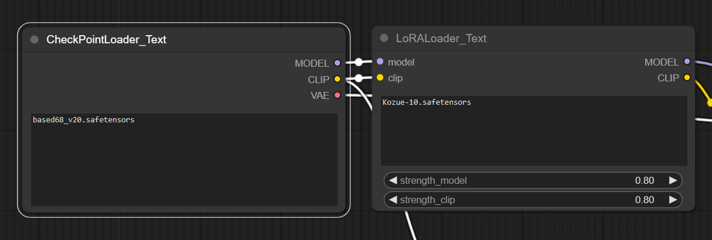
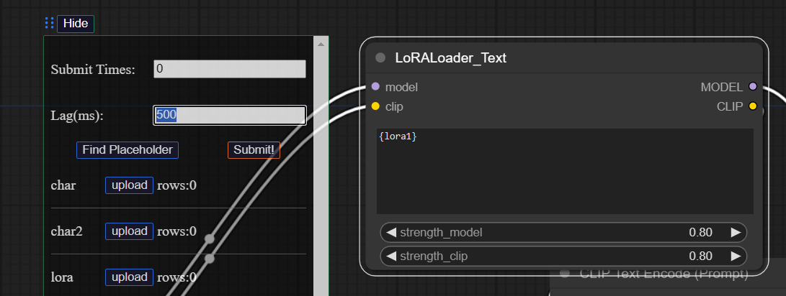

# Introduction

## Brief

An easy custom node that makes the some loaders' input as Text instead of file selector. 

For example, there are many characters in different loras respectively. If you want to generate different characters' pictures, you have to select corresponding lora, and then edit the prompt. It may cost much time. 

To solve this problem, You can use it with a chrome extension <https://github.com/Sieyalixnet/ComfyUI-Prompt-Formatter-Extension> that makes the queue prompt easier when you dealing with massive loras and prompt.

## How to install?

- download the codes and extract the zip in `\ComfyUI\custom_nodes`.
- clone this repository in `\ComfyUI\custom_nodes`

## Result

The input of lora loader and Checkpoints loader become Textarea instead of a file selector.

You can use the chrome extension the edit the input of the loader dynamically.